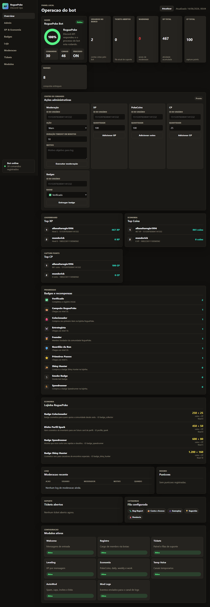
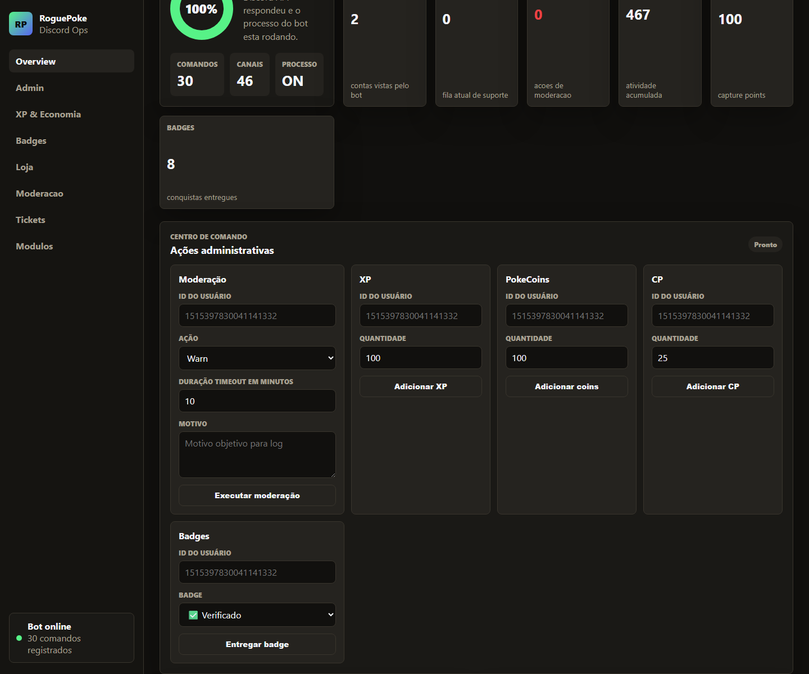
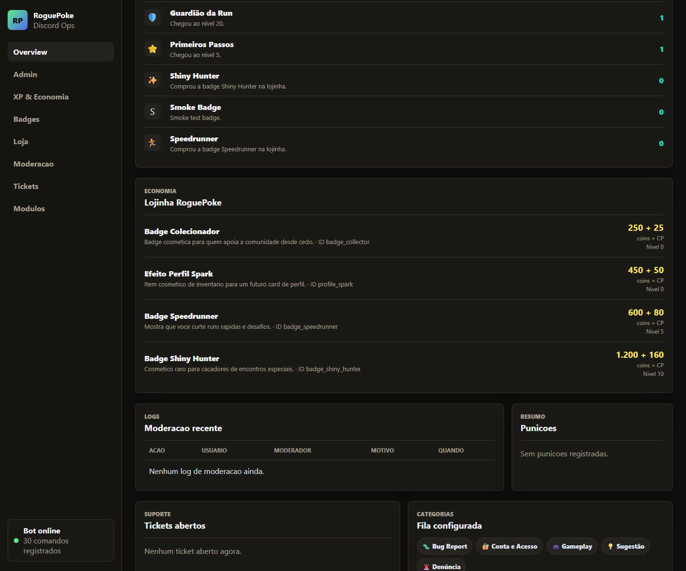

# Discord Server Automator


Open source toolkit to automatically create, configure and operate professional Discord community servers.

This repository includes:

- a Discord bot;
- an automated server setup script;
- a configurable server blueprint;
- a local operations dashboard;
- moderation, tickets, XP, economy, shop, badges and collectible creature systems.

The current included blueprint is a **RoguePoke demo community**. The project itself is generic: replace the blueprint, labels and rewards to automate any Discord community.

## Preview



| Admin center | Shop |
| --- | --- |
|  |  |

## What It Automates

- Creates roles, categories and channels from JSON.
- Applies permissions and locked/staff-only channels.
- Sends official pinned messages.
- Creates verification, language and ticket panels.
- Configures welcome, leveling, economy, AutoMod, tickets and temp voice.
- Seeds shop items, badges and collectible creatures.
- Provides a browser dashboard for operations.

## Features

- Config-driven Discord server setup.
- Verification flow with member role.
- Language roles.
- Ticket system with private channels, claim, close and transcript.
- Moderation commands and dashboard actions.
- AutoMod rules for spam, caps, invites and links.
- XP, ranks and level rewards.
- Economy with coins and CP.
- Shop with real resource spending.
- Badges that can map to visible Discord roles.
- Collectible creature system with capture attempts.
- Local dashboard with health, tickets, logs, economy, shop and admin controls.
- Smoke and system tests.

## Repository Scope

Only publish this folder to GitHub:

```text
roguepoke-discord/
```

Do not publish the parent workspace. The parent directory contains unrelated projects and local files.

## Architecture

```text
discord-bot/
  commands/                    Slash commands
  modules/                     Tickets, economy, creatures, automod, leveling
  events/                      Discord event handlers
  scripts/                     Setup, role cleanup, tests
  config/server-blueprint.json Current demo blueprint

dashboard/
  server.js                    Express API
  public/                      Browser dashboard
  scripts/capture-screenshots.js

docs/
  assets/screenshots/          GitHub screenshots
  GITHUB_PORTFOLIO.md
  OPERATIONS.md
  QA_REPORT.md
  SERVER_STRUCTURE.md
```

## Stack

- Node.js
- Discord.js v14
- Express
- SQLite with better-sqlite3
- Playwright for dashboard screenshots

## Requirements

- Node.js 20+
- Discord bot application
- Bot token
- Server ID
- Owner user ID
- Privileged intents enabled as needed

## Environment

Create `discord-bot/.env` from `discord-bot/.env.example`.

```env
DISCORD_TOKEN=your_discord_bot_token_here
CLIENT_ID=your_discord_application_client_id_here
GUILD_ID=your_test_guild_id_here
OWNER_USER_ID=your_discord_user_id_here
DASHBOARD_HOST=127.0.0.1
DASHBOARD_PORT=3000
```

Never commit `.env`, local databases, logs or PID files.

## Install

```bash
cd discord-bot
npm install

cd ../dashboard
npm install
```

## Run

Bot:

```bash
npm run start:bot
```

Dashboard:

```bash
npm run start:dashboard
```

Open:

```text
http://127.0.0.1:3000
```

## Server Setup

Dry run:

```bash
npm run setup:server:dry
```

Apply:

```bash
npm run setup:server
```

Clean old duplicated roles:

```bash
npm run cleanup:roles
```

## Tests

Run all checks from the repository root:

```bash
npm test
```

Individual checks:

```bash
npm run test:smoke
npm run test:system
```

Generate dashboard screenshots:

```bash
npm run screenshots
```

QA report: [docs/QA_REPORT.md](docs/QA_REPORT.md)

## Main Commands

Community:

- `/help`
- `/rank`
- `/leaderboard`
- `/badges`
- `/balance`

Economy:

- `/daily`
- `/weekly`
- `/work`
- `/shop`
- `/buy`
- `/inventory`

Creatures:

- `/bestiary`
- `/capture`
- `/creatures`

Moderation:

- `/warn`
- `/warnings`
- `/mute`
- `/kick`
- `/ban`
- `/clear`

## Economy Loop

The demo blueprint uses coins and CP:

1. Members participate in chat and voice.
2. The bot grants XP, coins and CP.
3. XP unlocks level rewards.
4. Coins + CP buy shop items.
5. Shop badges can grant visible Discord roles.
6. Creature capture attempts also spend coins + CP.

You can rename these resources for any community.

## Blueprint Customization

Start with:

```text
discord-bot/config/server-blueprint.json
```

Customize:

- role names;
- categories;
- channels;
- ticket categories;
- verification copy;
- language roles;
- shop items;
- badges;
- creature list;
- level rewards.

## Dashboard

The dashboard currently provides:

- bot/API/process health;
- registered command count;
- channel count;
- XP, coins and CP stats;
- moderation logs;
- ticket overview;
- shop overview;
- badge overview;
- admin actions.

Keep the dashboard local until authentication is implemented.

## Security

- Do not commit `.env`.
- Do not commit local SQLite databases.
- Do not expose the dashboard publicly without OAuth2/session auth.
- Review bot permissions before using Administrator in production.
- Rotate tokens if they are ever exposed.

See [SECURITY.md](SECURITY.md).

## Portfolio Notes

See [docs/GITHUB_PORTFOLIO.md](docs/GITHUB_PORTFOLIO.md) for repository topics, publish checklist and suggested GitHub copy.

## Contributing

See [CONTRIBUTING.md](CONTRIBUTING.md).

## License

MIT. See [LICENSE](LICENSE).
